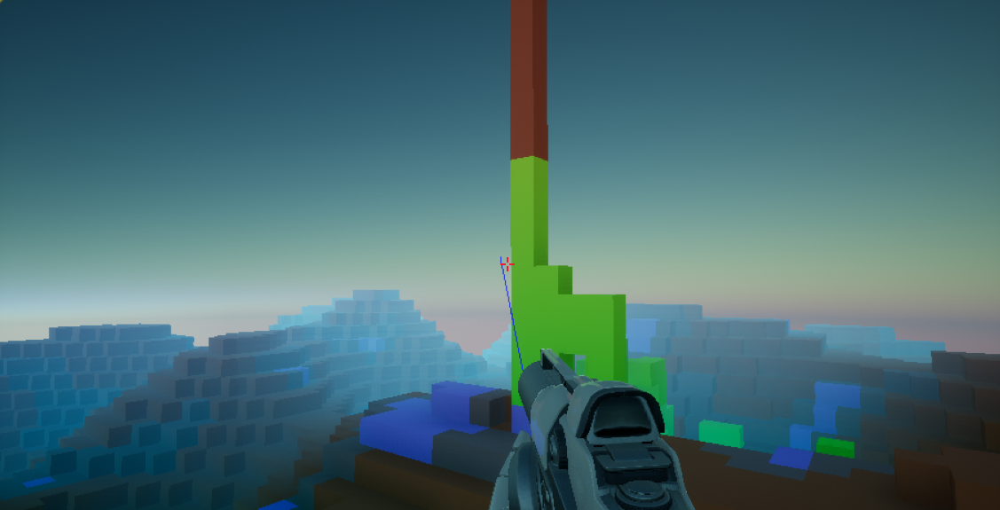
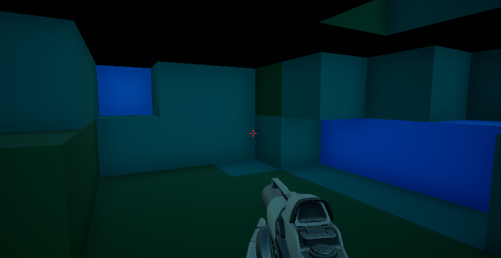

# CubeCraft

Developed with Unreal Engine 4, voxel, minecraft-like game.  

## Getting Started
  
This game is proceduraly generated. You can run around, spawn and destroy cubes and even save the game!.  
  
Procedural generation is controlled with a aworldmanager, place one instance of this class into your level.   
There you can setup all kinds of properties from blueprints!  
You can even define you own types of meshes that will be generated! (The maximum is 4 though, more are coming soon ;), also keep the   size of the bounding box around 100 units)  
Don't forget to assign maximum health to each type. So you can go on a destruction spree. :D  
  
The default pawn is CubeCraftCharacter. With it you can shoot cubes with left mouse button or change mode   
to spawning cubes with your right mouse button. You can scroll up and down to select different type of cubes.  
You can press P to save your game. (So many exciting choices! I know)  
  
You can walk up to a 10 kilometres from starting point to any direction and still be greeted with new terrain.  
  
Don't dig too deep! (You will experience never ending fall ... Altough if you want to expereience never ending fall go and dig deep :D) 
The Sky is the limit! I'm kidding you it's not ;) you can build very VERY tall towers, the limit should somewhere around 10 kilometres   though.  
(Would be a great view if it wouldnt be for that damned fog!)  
  
The save system is primitive, but very effective! :D  
If you setup name for your world in the world manager, and then hit P during play, the game will be saved. When you start game  
that has been saved it will be loaded (just be patient, you will spawn inside terrain but after 5 sec you will be back where you saved   the game). If you load your game, save it again before you end!  
In case you forget that you will loose parts of the world forever ... :(
  
## Cool features
The higher a block is the more red it is!, even those you placed yourself.(Prepared to build scarlet towers everywhere?)
  

## Upcoming features
Caves!! There will be caves at some point.. I promise.  
Performace gain!!! Experiencing lags? Fear not! I am already working on a better solution, there is already a branch dedicated to it.  
BEAMS! Tired of those boring debug lines? Me too! Soon there will be a proper destructive beam of death.  
Clouds, the sky is so plain that I need to get moving clouds out there.  
  

